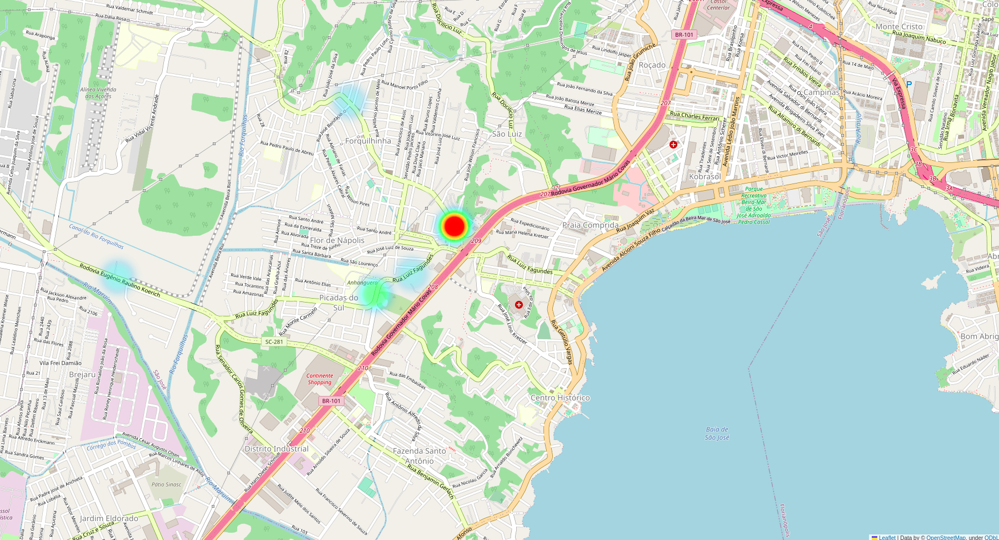

# Campanha de medição LoRaWan com gateway do campus IFSC-SJ

## Objetivo

Este trabalho tem o objetivo de coletar dados na área central de São José, em Santa Catarina, por meio do dispositivo [IoT DevKit - LoRaWAN](https://www.robocore.net/tutoriais/iot-devkit-introducao). Com estes dados, espera-se poder realizar o cálculo do expoente de perda, bem como determinar o alcance efetivo do gateway localizado no topo da caixa d'água do IFSC-SJ, em uma altura aproximada de 18 metros.

## Fundamentação teórica

### Modelo de Perda de Caminho Log-Distância

Os modelos de propagação teóricos e baseados em medições indicam que a potência média do sinal recebido diminui de forma logarítmica à medida que a distância aumenta, tanto em canais de rádio internos como externos.

A perda de caminho média em grande escala para uma separação transmissor ($T_x$) e receptor ($R_x$), qualquer $T_x-R_x$ é expressa como a função da distância usando um expoente de perda de caminho, $n$. Como na equação abaixo:


$$ \overline{PL}(dB) = \overline{PL}(d_0) + 10n\log_{}\left(\frac{d}{d_0}\right)
$$

Onde:
- $\overline{PL}(dB)$ é a perda de caminho estimado em $dB$
- $\overline{PL}(d_0)$ é a perda de caminho na distância de referência em $dB$
- $n$ é expoente de perda de caminho que indica a velocidade com a qual essa perda aumenta com relação à distância e depende do ambiente de propagação específico.
- $d_0$ é a distância de referência próxima determinada pelas medições perto do transmissor.
- $d$ é a distância de separação $T_x-R_x$
- As barras na equação indicam a média conjunta de todos os valores possíveis de perda de caminho para determinado valor de $d$.

### Modelo de Friis
Para realizar o cálculo do expoente de perda, primeiro deve-se encontrar a potência recebida na distância de referência ($d_0$). Por meio da equação abaixo:

$$ P_r(d) = \frac{P_t * G_t * G_r * \lambda^2}{(4\pi)^2 * d^2 * L}
$$

Onde:
- $P_r(d)$ é a potência recebida em $W$, a uma determinada distância $d$ em $m$.
- $P_t$ é a potência transmitida em $W$.
- $G_t$ é o ganho da antena transmissora em $W$.
- $G_r$ é o ganho da antena receptora em $W$.
- $\lambda$ é o comprimento da onda em $m$.
- $d$ é a distância em $m$.
- $L$ é a soma das perdas nas linhas do $T_x$ e $R_x$ em $W$.

### Cáluclo do expoente de perna $(n)$

$$ J(n) = \sum_{i=1}^k (P_i - E_i)^2$$

$$ E_i = P_0 - 10*n * \log_{10}(\frac{d_i}{d_0})$$

## Medições

Na tabela a seguir são apreentados os valores de latitude e longitude dos pontos de medições.

### Coordenadas dos pontos *outdoor*

|      Local            |   Distância (m)  |     Latitude     |    Longitude     |
|:---------------------:|:----------------:|:----------------:|:----------------:|
| Milium                | 1221             | -27.6075539      | -48.6390241      |
| Florifarma            | 2779             | -27.6077626      | -48.6616950      |
| Bradesco              | 1786             | -27.5957679      | -48.6438065      |
| Imobiliária Ideal     | 461              | -27.6042976      | -48.6357047      |
| Anhanguera            | 884              | -27.6089226      | -48.6418569      |

## Simulação dos pontos *outdoor* no *Radio Mobile*

Os pontos das medições *outdoor* foram utilizados para simulação com o *software* *Radio Mobile* e os resultados podem ser conferidos no diretório [radio-mobile](./radio-mobile/).

## Comparação entre dados simulados e medidos

A tabela a seguir apresenta uma comparação dos valores de Potência Recebida (RSSI) e Perda de caminho (PL) entre o dados simulados e medidos.

| Local               | RSSI simulada (dBm)  | PL simulada (dB) | RSSI medido (dBm) | PL medido (dB) |
|---------------------|----------------------|------------------|-------------------|----------------|
| Milium              | -86.92               | 98.89            | -109.045455       | 122.935455     |
| Florifarma          | -97.71               | 109.71           | -101.090909       | 114.980909     |
| Bradesco            | -88.72               | 100.73           | -107.000000       | 120.890000     |
| Imobiliária Ideal   | -80.08               | 92.06            | -85.6562500       | 99.5462500     |
| Anhanguera          | -107.79              | 119.79           | -96.6086960       | 110.498696     |


## Cálculos

### Potência recebida no ponto de referência:

$$P_r(235) = \frac{0,025 * 1,584 * 3,162 * 0,32^2}{157,91 * 55.225 * 7,943} => \frac{0,134}{69,267 * 10^6}$$

$$P_r(235) = 1,934 * 10^{-10} W => -67,134 dBm$$


### Expoente de perda $(n)$

Utilizando o código abaixo, obteve-se o valor de $n$ simulado e medido:

```matlab
clear all; close all; clc;

syms n

% Potências calculadas no RadioMobile

A = [235 -67.134    % Ponto de referência
    461 -80.08      % imobiliaria ideal
    1204 -86.92     % Millium
    1786 -88.72     % Bradesco
    2779 -97.71];   % Florifarma

% Potência medida

B = [235 -67.12     % Ponto de referência
    461 -84         % Imobiliária Ideal
    926 -91         % Anhanguera
    1786 -104.5];   % Bradesco

J = 0;
for i = 1:5
   Ei(i) = A(1,2) - 10*n*log10(A(i,1)/A(1,1));
   J = J + (A(i,2)-Ei(i))^2;
end

J2 = diff(J);
N = double(solve(J2,n))

J = 0;
for i = 1:4
   Ei(i) = B(1,2) - 10*n*log10(B(i,1)/B(1,1));
   J = J + (B(i,2)-Ei(i))^2;
end

J2 = diff(J);
N = double(solve(J2,n))
```

#### Resultados:

|   | Simualdo | Medido |
|:-:|:--------:|:------:|
| n | 2.7682   | 4.2829 |


# Mapa de Calor




# Conclusão

Este trabalho enfatizou a necessidade de incorporar variáveis práticas na modelagem de redes LoRaWAN. A análise comparativa entre os dados simulados e os dados medidos revelou diferenças significativas entre os resultados obtidos no Radio-Mobile e aqueles observados em campo. Isso destaca a importância de considerar a influência de condições reais no ambiente de propagação ao projetar e avaliar redes LoRaWAN.