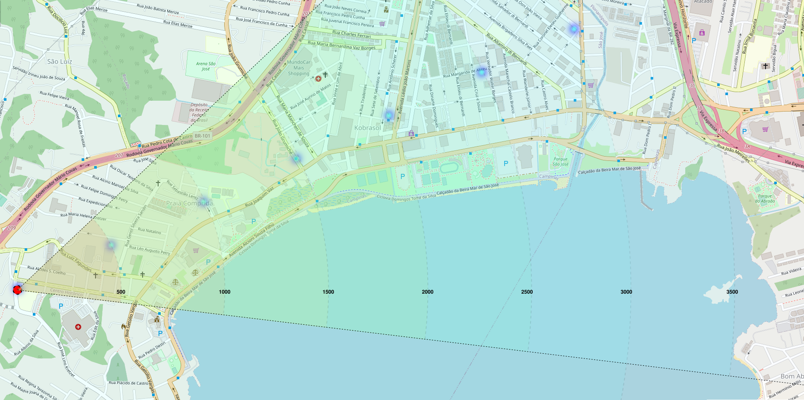

# Campanha de medição LoRaWan com gateway do campus IFSC-SJ

## Objetivo

Este trabalho tem o objetivo de coletar dados na área central de São José, em Santa Catarina, por meio do dispositivo [IoT DevKit - LoRaWAN](https://www.robocore.net/tutoriais/iot-devkit-introducao). Com estes dados, espera-se poder realizar o cálculo do expoente de perda, bem como determinar o alcance efetivo do gateway localizado no topo da caixa d'água do IFSC-SJ, em uma altura aproximada de 18 metros.

## Fundamentação teórica

### Modelo de Perda de Caminho Log-Distância

Os modelos de propagação teóricos e baseados em medições indicam que a potência média do sinal recebido diminui de forma logarítmica à medida que a distância aumenta, tanto em canais de rádio internos como externos.

A perda de caminho média em grande escala para uma separação transmissor ($T_x$) e receptor ($R_x$), qualquer $T_x-R_x$ é expressa como a função da distância usando um expoente de perda de caminho, $n$. Como na equação abaixo:

$$ \overline{PL}(dB) = \overline{PL}(d_0) + 10n\log_{}\left(\frac{d}{d_0}\right)
$$

onde:
- $\overline{PL}(dB)$ é a perda de caminho estimado em $dB$
- $\overline{PL}(d_0)$ é a perda de caminho na distância de referência em $dB$
- $n$ é expoente de perda de caminho que indica a velocidade com a qual essa perda aumenta com relação à distância e depende do ambiente de propagação específico.
- $d_0$ é a distância de referência próxima determinada pelas medições perto do transmissor.
- $d$ é a distância de separação $T_x-R_x$
- As barras na equação indicam a média conjunta de todos os valores possíveis de perda de caminho para determinado valor de $d$.

### Sombreamento log-normal

<!-- a equação anterior não considera o fato de o ruído ambiental ao redor pode ser diferente em dois locais distintos tendo a mesma separação $T-R$, o que leva a sinais medidos diferentes do valor médio da equação anterior -->

A distribuição log-normal descreve os efeitos aleatórios do sombreamento, que ocorrem em vários locais próximos que possuem a separação $T_x-R_x$ , mas com diferentes níveis de ruído no caminho de propagação. O sombreamento log-normal implica que os níveis de sinal medidos em uma separação $T_x-R_x$ específica seguem uma distribuição gaussiana (normal) em torno da média que depende da distância.

## Cálculos

@TODO

## Medições

Na tabela a seguir são apreentados os valores de latitude e longitude dos pontos de medições.

### Coordenadas dos pontos *outdoor*

|      Local            |   Distância (m)  |     Latitude     |    Longitude     |
|:---------------------:|:----------------:|:----------------:|:----------------:|
| Milium                | 1235.06          | -27.6075539      | -48.6390241      |
| Florifarma            | 2807.82          | -27.6077626      | -48.6616950      |
| Bradesco              | 1785.89          | -27.5957679      | -48.6438065      |
| Imobiliária Ideal     | 476.73           | -27.6042976      | -48.6357047      |
| Anhanguera            | 840.15           | -27.6089226      | -48.6418569      |

## Simulação dos pontos *outdoor* no *Radio Mobile*

Os pontos das medições *outdoor* foram utilizados para simulação com o *software* *Radio Mobile* e os resultados podem ser conferidos no diretório [radio-mobile](./radio-mobile/).

## Comparação entre dados calculados, simulados e medidos

A tabela a seguir apresenta uma comparação dos valores de Potência Recebida (RSSI) e Perda de caminho (PL) entre o dados calculados, simulados e medidos.

| Local               | RSSI calculado (dBm) | PL calculado (dB)  | RSSI simulada (dBm)  | PL simulada (dB) | RSSI medido (dBm) | PL medido (dB) |
|---------------------|----------------------|--------------------|----------------------|------------------|-------------------|----------------|
| Milium              | -110                 | 122.935455         | -90.85               | 102.83           | -109.045455       | 122.935455     |
| Florifarma          | -100                 | 114.980909         | -97.71               | 109.71           | -101.090909       | 114.980909     |
| Bradesco            | -104.5               | 120.890000         | -88.72               | 100.73           | -107.000000       | 120.890000     |
| Imobiliária Ideal   | -84                  | 99.546250          | -73.66               | 85.64            | -85.6562500       | 99.5462500     |
| Anhanguera          | -91                  | 110.498696         | -119.09              | 131.09           | -96.6086960       | 110.498696     |

<!-- > 1. Valores obtidos adicionando uma variável aleatória gaussiana de média 0 e desvio padrão de 10,91 ao valor calculado, então podem mudar a cada execução.
> 2. Simulação realizada no software *Radio Mobile*  -->

<!-- ## Parâmetros obtidos
A partir do método de minimização de erro MSE utilizado no código, o valor do parâmetro N obtido está representado na tabela abaixo.

|        | p0 ($dB$) | d0 (m)  | N     |
|--------|------------|---------|-------|
| Outdoor| -77,8      | -80,89  | 2,519 | -->

<!-- ## Mapa de calor

Com o N estimado pela minimização citada acima, foram obtidos estes valores de RSSI (estes valores utilizam uma variável aleatória gaussiana e podem mudar a cada execução).

| Distância (m) | RSSI ($dB$)          |
|-----------|---------------|
| 1         | -21.42376652  |
| 500       | -89.43267884  |
| 1000      | -97.00470094  |
| 1500      | -101.43679616 |
| 2000      | -104.58218069 |
| 2500      | -107.02225042 |
| 3000      | -109.01609695 |
| 3500      | -110.70196579 |

Abaixo o mapa de calor:

 -->
